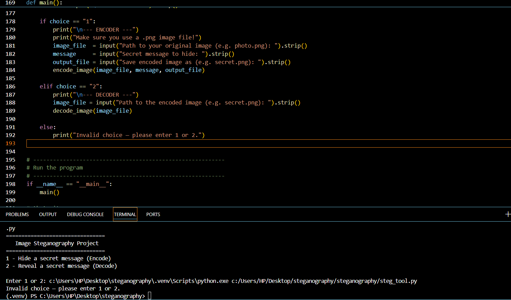

# SteganoHide

A Python CLI tool for hiding secret text in PNG images using LSB (Least Significant Bit) steganography.

## Demo



<br>

[](https://github.com/ivadebandit/steganography-tool)

## Features

* **Encodes secret messages** into any standard `.png` image file.
* **Decodes hidden messages** from processed images to reveal the original text.
* **Uses LSB steganography** for invisible data embedding that preserves image quality.
* **Simple CLI menu** to guide the user through the process.
* **Immediate feedback** provided directly in your terminal.

## Quick Start

Get up and running in three simple steps:

```bash
# 1. Clone and enter the project
git clone https://github.com/ivadebandit/steganography-tool.git
cd steganography-tool

# 2. Install dependencies
pip install -r requirements.txt

# 3. Launch the tool
python steg_tool.py
```

## Local Development

### Prerequisites

- Python 3.10+
- Git

### Setup

Clone and Setup Environment:

```bash
git clone https://github.com/ivadebandit/steganography-tool.git
cd steganography-tool
python -m venv .venv
.venv\Scripts\activate
```

Install Dependencies:

```bash
pip install -r requirements.txt
```

## Technical Details

This tool uses LSB steganography to modify the Red channel of pixels. The decoder scans the image in the exact sequence as the encoder, gathering values until it hits the STOP_SIGNAL (0), then maps the integers back to text via ASCII. No external system dependencies are required.
